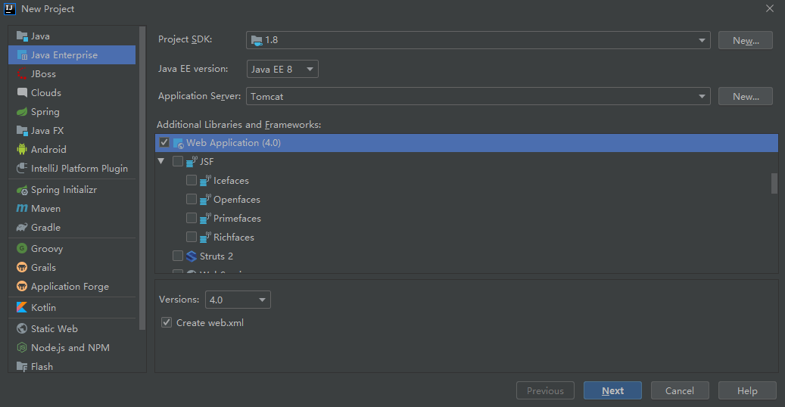

## Web Project

### 项目结构



```txt
Project:
├─src
│      *.java
│
└─web
    │  index.jsp
    │
    ├─static
    │      *.css
    │      *.js
    │
    └─WEB-INF
        │  web.xml
        │
        ├─classes
        │      *.class
        │
        ├─jsp
        │      *.jsp
        │
        └─lib
                *.jar
```

### 项目部署

部署项目有以下三种方式。

1、直接将项目放置到`webapps`目录下

2、修改`conf/server.xml`文件

```XML
      <!-- ... -->

      <Host ...>

        <!-- ↓↓↓新增部分↓↓↓ -->
        <Content docBase="{系统目录}" path="{映射URL}"/>
        <!-- ↑↑↑新增部分↑↑↑ -->

      </Host>
    </Engine>
  </Service>
</Server>
```

3、新建`conf/Catalina/localhost/{映射URL}.xml`文件

```XML
<!-- ↓↓↓新增部分↓↓↓ -->
<Content docBase="{系统目录}"/>
<!-- ↑↑↑新增部分↑↑↑ -->
```
